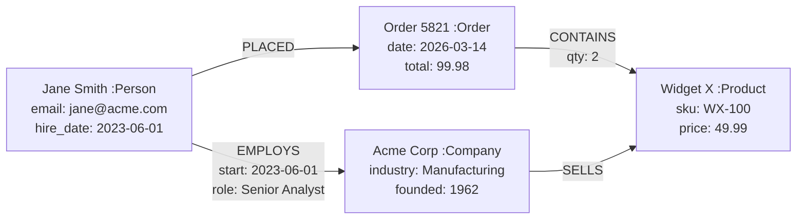
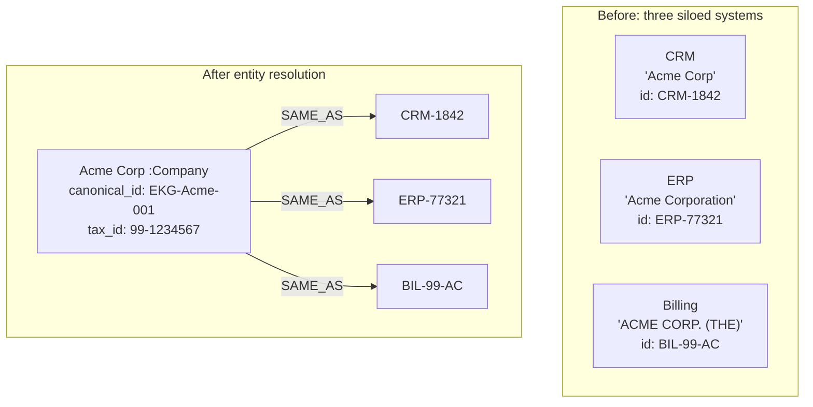
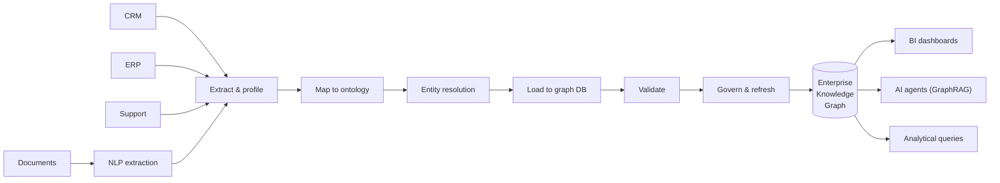
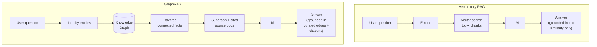

# Knowledge Graphs and the Enterprise Knowledge Graph

## Summary

Covers labeled property graphs, ontologies and taxonomies, Cypher and GQL, graph databases (Neo4j, Neptune, TigerGraph, Memgraph), graph algorithms, entity resolution, the Enterprise Knowledge Graph as a 'single source of meaning,' and GraphRAG for grounding generative AI in trustworthy organizational knowledge.

**Role in the course:** Position the EKG as the semantic backbone of the AI-ready enterprise — the layer that unifies siloed application data into something humans and AI agents can both query.

## Concepts Covered

This chapter covers the following 29 concepts from the learning graph:

1. Knowledge Graph
2. Property Graph Model
3. Node and Edge
4. Graph Schema
5. Ontology
6. Taxonomy in IS
7. Schema.org
8. Domain Vocabulary
9. Cypher Query Language
10. GQL Standard
11. Neo4j
12. Amazon Neptune
13. TigerGraph
14. Memgraph
15. Graph Traversal
16. Graph Algorithm
17. Shortest Path
18. Community Detection
19. Centrality
20. Entity Resolution
21. Identity Reconciliation
22. Record Linkage
23. Enterprise Knowledge Graph
24. Semantic Layer
25. Single Source of Meaning
26. GraphRAG
27. Vector and Graph Hybrid
28. KG Construction
29. KG from Unstructured Text

## Prerequisites

This chapter builds on concepts from:

- [Chapter 1: Foundations of Information Systems](../01-foundations/index.md)
- [Chapter 3: Information Systems Architecture](../03-architecture/index.md)
- [Chapter 6: Data Management Foundations: Modeling, SQL, and Transactions](../06-data-foundations/index.md)
- [Chapter 8: Data Governance and Quality](../08-data-governance/index.md)
- [Chapter 19: AI in Information Systems](../19-ai-in-is/index.md)

---

!!! mascot-welcome "Welcome back"
    
    Welcome to Chapter 24. This is the chapter I have been waiting for the entire book. Knowledge graphs are the topic where everything we have learned — databases, ontologies, governance, AI — finally clicks into a single shape. We are going to do some genuinely fun things in here, and by the end you will know exactly why your CRM and your ERP have been quietly lying to each other for the last decade, why nobody noticed, and what an Enterprise Knowledge Graph does to stop the lying. You will learn to read Cypher, you will know four graph databases by name, you will understand why GraphRAG is the structural fix for the hallucination problem we couldn't solve in Chapter 19, and you will be able to draw — on a whiteboard, in front of skeptical adults — the picture that explains it all. Let's go.

## Why Graphs, and Why Now

For most of the database era we have stored the world as tables. Customers in one table, orders in another, products in a third, and then we *join* them at query time to recover the relationships we already knew existed. Tables are wonderful for the work they were designed for: counting rows, summing dollars, rolling up to the quarter. They are not so wonderful for the question that increasingly dominates modern IS: *show me how these things are connected, and what that connectivity implies.*

Three forces pushed graphs from a niche curiosity into a board-level topic in the 2020s. The first was the explosion of *interconnected data* — supply chains, social networks, fraud rings, drug-interaction databases, and product recommendation systems all share the property that the *connections matter as much as the entities*. The second was the rise of *AI agents and large language models*, which need *semantically grounded* answers and which, when given only vector similarity, will hallucinate confidently and at industrial scale. The third was the slow-motion realization across the Fortune 500 that nobody actually has a single source of truth about *meaning* — about what a "customer" is, who counts as the "same" supplier across regions, or which contracts touch which obligations. Graphs are the data shape that solves all three problems at once. They are not the only tool, but they are the connective tissue that turns the rest of your stack into something a human or a machine can reason about.

## Knowledge Graph: The Idea

A **Knowledge Graph** is a data structure that represents knowledge as a network of entities and the relationships between them, where both the entities and the relationships are first-class, queryable objects. The phrase was popularized by Google in 2012 when they began returning structured facts about people, places, and things directly in search results — but the underlying idea is older, and the modern enterprise version goes much further than a search-engine sidebar.

Three things distinguish a knowledge graph from a generic database. First, *relationships are explicit and named*: the link between *Acme Corp* and *Jane Smith* is not a foreign key in some hidden join table, it is a concrete edge labeled `EMPLOYS` with its own properties. Second, *the schema is flexible enough to evolve*: you can add a new relationship type or a new entity type without rewriting the rest of the graph. Third, *the model is meant to be queried by traversal*: questions like "find all customers who share an address with a known fraud account, two hops away" are natural in a graph and gymnastic in SQL.

## The Property Graph Model

The dominant flavor of knowledge graph in enterprise IS is the **Property Graph Model**: a graph in which both nodes and edges can carry an arbitrary set of key-value *properties*, and where nodes are tagged with one or more *labels*. A node representing Jane Smith might have the label `Person` and properties like `name: "Jane Smith"`, `email: "jane@acme.com"`, `hire_date: "2023-06-01"`. The edge connecting her to Acme Corp might be labeled `EMPLOYS` and carry properties like `start_date: "2023-06-01"`, `role: "Senior Analyst"`.

Property graphs are not the only model — the older RDF (Resource Description Framework) world models knowledge as triples of *subject-predicate-object* and is favored in semantic web and life-sciences communities. The two camps have argued amicably for two decades; in 2026 the property-graph model dominates enterprise adoption, though RDF remains strong in regulated and standards-heavy domains. The difference matters less than it used to: the new GQL standard (which we'll meet shortly) was designed so that property graph and RDF tooling can interoperate.

| Dimension | Property Graph | RDF (Triple Store) |
|---|---|---|
| Atomic unit | Node or edge with properties | Subject-predicate-object triple |
| Edge identity | Edges are first-class objects with their own properties | Edges are just predicates linking subjects to objects |
| Schema | Optional, evolves with use | Often paired with formal OWL ontologies |
| Query language | Cypher, GQL, Gremlin | SPARQL |
| Typical adopters | Enterprise apps, fraud, recommendations | Pharma, government, semantic web |
| Strengths | Developer ergonomics, native edge properties | Formal semantics, federation across vocabularies |

## Node and Edge: The Atoms

Before we draw anything, we need the vocabulary precisely.

A **Node** (sometimes called a *vertex*) is the graph's representation of an entity — a thing in the world we want to talk about. Customers, employees, products, suppliers, documents, locations, contracts, and incidents are all nodes. A node has zero or more *labels* (categories it belongs to, like `:Customer` or `:Person`) and zero or more *properties* (key-value attributes that describe it).

An **Edge** (sometimes called a *relationship* or *link*) is the graph's representation of a connection between two nodes. Edges in a property graph are *directed* — they point from a source node to a target node — and *labeled* with a relationship type like `PURCHASED`, `REPORTS_TO`, or `CONTAINS`. Like nodes, edges can carry their own properties: a `PURCHASED` edge might record the date, quantity, and price of the purchase.

A *property* is a key-value pair attached to a node or edge. Properties are the equivalent of columns in a table, except every node or edge can carry a different set of them.

<details markdown="1">
<summary>A small property graph: Acme Corp and Jane Smith</summary>



Read it as: Jane is employed by Acme; Jane placed an order; that order contains two units of Widget X; Acme sells Widget X. Notice that the *relationship between Jane's order and the company that makes the product she bought* is two hops away — a classic graph-shaped question.

</details>

## Graph Schema: Optional but Earned

A **Graph Schema** is an explicit definition of which node labels exist, which relationship types exist, which properties they carry, and which connections are allowed. Some graph databases enforce the schema strictly; others treat it as advisory and let new shapes emerge as the data evolves. Both modes have legitimate uses.

The systems-thinking tradeoff is *relational rigor versus graph flexibility*. A relational schema rejects bad data at write time — that is its superpower and the reason ACID systems run banks. A graph database that lets any node connect to any other node by any relationship is exquisitely flexible — and exquisitely capable of accumulating quiet inconsistency. Most mature enterprise graphs sit on a middle path: a well-defined core schema for the entities everyone agrees about (Customer, Product, Order, Employee), with controlled extensibility around the edges where new domains and new use cases keep arriving.

## Ontology: The Formal Model of Meaning

An **Ontology** is a formal, shared specification of the entities, properties, and relationships in a domain — and crucially, of the *rules* that govern how those things behave. An ontology says not just "we have Persons and Companies and an EMPLOYS relationship" but "every EMPLOYS relationship has a Person at one end and a Company at the other; an EMPLOYS relationship has a start date; an Employee is a kind of Person who currently has at least one active EMPLOYS relationship." Ontologies are how an organization writes down what its words actually *mean*, in a form precise enough that a machine can check for contradictions.

Ontologies range from lightweight (a glossary with parent-child relationships) to heavyweight (formal OWL ontologies with class hierarchies, axioms, and automated reasoners). The right depth depends on the use case. A pharmaceutical company tracking drug-target interactions needs a deep, formal ontology because patient lives are downstream. A retailer tagging products for recommendations may be perfectly served by a light vocabulary plus a taxonomy.

The classic unintended consequence here is the *ontology committee that takes two years to ship anything*. A well-meaning team gathers every stakeholder, debates whether a *prospect* is a kind of *customer* or its own thing, models 47 subtypes of *contract*, and emerges a year later with a perfect ontology that nobody is allowed to change. Meanwhile the business has launched three new product lines and the ontology no longer matches reality. The cure is *iterative ontology development* — start small, deploy something useful, let the working graph push back on the model, and grow the ontology in response to actual queries people are running.

## Taxonomy in IS

A **Taxonomy in IS** is a hierarchical classification scheme — a tree (or sometimes a DAG) of categories, where each category is a kind of its parent. Product categories ("Electronics > Audio > Headphones > Wireless"), document types ("Contract > Sales > MSA"), and incident classifications in ITSM are all taxonomies. Taxonomies are the simplest form of structured vocabulary and the easiest to build, which is why most organizations have several.

It is worth being precise about the relationship among three terms that often get conflated.

| Term | What it is | Example |
|---|---|---|
| Taxonomy | Hierarchy of categories (is-a tree) | Product > Audio > Headphones |
| Ontology | Formal model of entities, relationships, and rules | Person EMPLOYED_BY Company; Employee subclass of Person |
| Graph schema | Constraints a graph database enforces | Node :Person must have property `email` |

A taxonomy is roughly a slice of a richer ontology — the *is-a* hierarchy, without the other relationship types or rules. An ontology contains taxonomies but goes much further. A graph schema is the *enforcement layer* a database applies; it may be derived from an ontology, but it does not have to capture every nuance of meaning.

## Schema.org and Domain Vocabularies

You do not always have to invent your own ontology. **Schema.org** is a public, shared vocabulary maintained collaboratively by Google, Microsoft, Yahoo, and Yandex, originally created to help search engines understand web pages and now widely reused in enterprise knowledge graphs. Schema.org defines several hundred entity types — `Person`, `Organization`, `Product`, `Event`, `Recipe`, `MedicalCondition` — along with their properties and relationships. Reusing schema.org for the *common* parts of your graph means your data interoperates with the rest of the world by default, and your team does not spend three months arguing about whether a `Person` should have a `givenName` or a `firstName`.

A **Domain Vocabulary** is a shared set of terms for a specific industry or function: SNOMED CT for clinical concepts in healthcare, FIBO for financial industry terms, GS1 for retail product identifiers, GO (Gene Ontology) for biology. When you are building a graph in a regulated or standards-heavy domain, *start by adopting the domain vocabulary*. Inventing your own equivalents is a one-way ticket to integration pain in year three.

The pattern most mature enterprise graphs settle on is a layered vocabulary: schema.org for the universal stuff, a domain vocabulary for the industry stuff, and a thin organization-specific extension for the parts that are genuinely unique to your business.

!!! mascot-thinking "Iris's Pause"
    
    Pause. The reason your CRM and your ERP have been quietly lying to each other is that they each invented their own vocabulary in isolation. The CRM's *customer* and the ERP's *customer* are slightly different shapes, with slightly different identifiers, and nobody — not the analytics team, not the AI agent, not the executive looking at the dashboard — can confidently answer "is this the same customer?" The Enterprise Knowledge Graph fixes that, but only because we agreed first on a *vocabulary*. Read this section twice. The ontology is the load-bearing wall everything else hangs from.

## Graph Traversal: Moving Along Edges

A **Graph Traversal** is the process of moving from a starting set of nodes along edges to reach related nodes. Most useful graph queries are traversals: "starting at Jane, find everyone she has emailed, then everyone *those* people have emailed, then check if any of them work at a competitor." Traversals are the graph's native idiom; they are what graph databases make fast and SQL makes painful.

Traversals can be *fixed-depth* (always exactly two hops) or *variable-depth* (between one and five hops, until a condition is met), *directed* (follow edges only in their stated direction) or *undirected* (treat edges as two-way), and *filtered* by node label, edge type, or property value. Most production queries combine all of these.

## Cypher Query Language

**Cypher Query Language** is the most widely used query language for property graphs. Originally developed by Neo4j and later released as an open specification (openCypher), Cypher reads like ASCII art for graphs: parentheses are nodes, square brackets are relationships, dashes are edges. The clauses you'll meet most often are `MATCH` (find a pattern), `WHERE` (filter results), `RETURN` (specify what to send back), `CREATE` (add nodes and edges), and `MERGE` (find-or-create).

Let's build up to a real query. Suppose we want to ask: *who works at Acme Corp?*

In plain language: find every node tagged as a Person who is connected by an EMPLOYS relationship to a node tagged Company whose name is "Acme Corp", then return the names of those people. In Cypher each clause does one job: `MATCH` describes the *pattern* in the graph; `(p:Person)` means a node bound to variable `p` with label `Person`; `[:EMPLOYS]` is the relationship type; `(c:Company {name: "Acme Corp"})` is a node with label `Company` filtered to the one whose name property equals the string; `RETURN` selects the values to send back.

```cypher
MATCH (p:Person)<-[:EMPLOYS]-(c:Company {name: "Acme Corp"})
RETURN p.name AS employee
ORDER BY employee;
```

Now a traversal that goes more than one hop. Imagine fraud investigators asking: *for the suspicious account A-9981, find every other account that shares an address with it, two hops away or fewer, that is also flagged as high-risk.* Here `MATCH` again finds a pattern; the `*1..2` syntax means "follow this relationship type between one and two times" — that's the variable-depth traversal; `WHERE` filters by a property; `RETURN DISTINCT` removes duplicates that arise when multiple paths reach the same node.

```cypher
MATCH (a:Account {id: "A-9981"})
      -[:SHARES_ADDRESS*1..2]-
      (other:Account)
WHERE other.risk_flag = "HIGH"
  AND other.id <> "A-9981"
RETURN DISTINCT other.id, other.opened_date
ORDER BY other.opened_date;
```

One more, because the third example is the one your future fraud-team manager will actually ask you to write. *Find any pair of customers who placed orders shipping to the same address within seven days of each other, and return them along with the address.* `MATCH` finds two `PLACED -> Order -> SHIPPED_TO -> Address` patterns sharing the address node `addr`; the `<>` operator means "not equal to," ensuring the two customers are different; the date arithmetic in `WHERE` ensures the orders are within a week.

```cypher
MATCH (c1:Customer)-[:PLACED]->(o1:Order)-[:SHIPPED_TO]->(addr:Address),
      (c2:Customer)-[:PLACED]->(o2:Order)-[:SHIPPED_TO]->(addr)
WHERE c1.id <> c2.id
  AND abs(duration.between(o1.date, o2.date).days) <= 7
RETURN c1.id, c2.id, addr.line1, o1.date, o2.date;
```

In SQL, that last query needs three or four self-joins through an order-line table, an address table, and probably a CTE or two; in Cypher the *shape* of the question and the *shape* of the query are the same. That correspondence is Cypher's superpower.

## GQL Standard: Graphs Get a Standard Query Language

In April 2024, ISO published **GQL** (Graph Query Language) as the international standard for property graph queries — the first new ISO database query language since SQL in 1986. GQL borrows heavily from Cypher, incorporates ideas from PGQL and G-CORE, and is designed to do for graph databases what SQL did for relational ones: give the industry a common dialect that survives any one vendor.

For students entering the field today, the practical implication is straightforward. Cypher remains the dialect you'll write the most of in the short term, especially against Neo4j. GQL is what you'll see standardized across multi-vendor deployments going forward. The two are close enough that competence in one transfers to the other almost instantly. The bigger point is that *graph databases now have a standardized query language*, which is the signal that the technology has crossed from frontier to mainstream.

## Graph Databases: Four Names to Know

A graph database is a database engine optimized for storing and querying graph-shaped data. The four you should be able to recognize and reason about are these.

**Neo4j** is the original commercial property graph database and still the market leader by a wide margin. It is the reference implementation of Cypher; its developer ecosystem (Bloom, GDS — the Graph Data Science library, a generous community edition) is the most mature; and it is what most enterprise graph projects end up using. If you are learning graphs for the first time, learn them on Neo4j.

**Amazon Neptune** is AWS's managed graph database service. Neptune supports both property graphs (via Gremlin and openCypher) and RDF triple stores (via SPARQL) in the same engine — a useful property for organizations that have to bridge both worlds. Neptune's strengths are tight AWS integration, managed scaling, and zero ops; its tradeoff is the usual cloud-vendor lock-in.

**TigerGraph** is a graph database designed from the ground up for very large analytical workloads — billions of nodes, hundreds of billions of edges — with a query language called GSQL that emphasizes deep, parallelized traversals. TigerGraph shows up most often in fraud, anti-money-laundering, and supply-chain analytics where the question is "compute a 10-hop pattern across the whole graph in seconds."

**Memgraph** is an in-memory, open-source property graph database focused on real-time and streaming use cases — fraud scoring on transactions arriving at thousands per second, network monitoring, dynamic recommendations. Memgraph is Cypher-compatible, which means much of what you learn on Neo4j carries over directly.

| Database | Model | Query language(s) | Sweet spot | Hosting |
|---|---|---|---|---|
| Neo4j | Property graph | Cypher / GQL | General-purpose enterprise graphs, OLTP + analytics | Self-host or Aura (cloud) |
| Amazon Neptune | Property + RDF | Gremlin, openCypher, SPARQL | AWS-native, mixed property/RDF | Managed AWS service |
| TigerGraph | Property graph | GSQL | Massive analytical traversals (fraud, AML) | Self-host or cloud |
| Memgraph | Property graph (in-memory) | Cypher | Real-time, streaming, sub-millisecond latency | Self-host or cloud |

## Graph Algorithms: The Library That Comes With the Database

A **Graph Algorithm** is a computational procedure that operates on the structure of a graph to compute something useful — a path, a score, a community, a ranking. Modern graph databases ship with libraries of dozens of these algorithms; you call them from your query language without implementing them yourself. Three families are worth knowing by name.

**Shortest Path** algorithms find the minimum-cost path between two nodes — fewest hops, lowest total weight, or some combination. The classic Dijkstra and A* algorithms are part of every graph database's standard library. Use cases include routing (literal map directions), supply-chain trace-back ("what is the shortest path from this defective part to every customer who bought a product containing it"), and influence analysis ("how many degrees of separation between this employee and that board member").

**Community Detection** algorithms find clusters of densely connected nodes — groups that interact more with each other than with the rest of the graph. The Louvain algorithm and Leiden algorithm are the workhorses. Use cases include customer segmentation (people who buy from the same set of vendors), fraud-ring detection (accounts linked through addresses, devices, and beneficiary relationships), and organizational analysis (informal teams that emerge from email and meeting patterns).

**Centrality** algorithms score how *important* each node is in the graph by some measure of connectivity. Degree centrality counts edges; betweenness centrality measures how often a node sits on the shortest path between other pairs; PageRank — yes, the algorithm that built Google — propagates importance through the link structure. Use cases include identifying influential customers, key suppliers whose failure would ripple, and the people whose Slack messages everyone else replies to.

The systems-thinking point: graph algorithms reveal structure that is *invisible* in tabular data. A community-detection run across customer-product-order data routinely discovers segments the marketing team has never noticed. A betweenness-centrality run across an org chart routinely identifies the *real* coordinators in a company — who are often two levels below the people on the official chart. Graphs are how you see the organization as it actually behaves, not as it is documented.

!!! mascot-tip "Iris's Tip"
    
    Pro move: when you are pitching a knowledge graph to a skeptical executive, do not lead with the architecture diagram. Lead with a community-detection run on data they already own. Show them the cluster of customers nobody on the marketing team had noticed, or the supplier-concentration risk three hops upstream that procurement never flagged. *Then* unfold the architecture. The graph sells itself when the audience sees something they could not see before.

## Entity Resolution: The Foundational Lever

Here is the part of the chapter where the EKG starts to earn its keep. Real organizations do not have one record for each customer — they have *seven*, scattered across the CRM, the ERP, the support system, the billing platform, the marketing automation tool, the loyalty program, and that one Excel sheet a sales rep has been emailing around since 2019. Each system spells the customer's name slightly differently, has a slightly different address, uses a different identifier, and is confident it is correct.

**Entity Resolution** is the process of determining which records, across one or many sources, refer to the *same real-world entity*. Entity resolution is the foundational lever of every Enterprise Knowledge Graph: until you know that the *Acme Corp* in your CRM is the same *Acme Corporation* in your ERP and the same *ACME CORP. (THE)* in your billing system, no graph you build on top of those sources can be trusted.

**Identity Reconciliation** is a closely related term, used most often in the customer-data domain to describe the ongoing process of stitching together identifiers that refer to the same person across channels — the email used in one transaction, the phone number used in another, the device cookie in a third. Identity reconciliation is the streaming, real-time cousin of entity resolution; the underlying problem is the same.

**Record Linkage** is the older, statistical-tradition name for the same problem, originating in census, public-health, and vital-records work decades before the term *entity resolution* existed. Record linkage emphasizes probabilistic matching — every candidate pair gets a score; pairs above a threshold are merged; pairs near the threshold get human review.

The techniques you'll meet in any production entity-resolution pipeline:

- **Deterministic matching** — exact comparison on a small set of strong identifiers (tax ID, government-issued ID, verified email). Cheap and unambiguous, but only catches the easy cases.
- **Fuzzy string matching** — compare names, addresses, and other text fields with similarity metrics like Jaro-Winkler or Levenshtein distance to forgive typos and variant spellings.
- **Phonetic matching** — Soundex, Metaphone, and similar algorithms that compare how a string *sounds* rather than how it is spelled, useful for names across languages and transliterations.
- **Probabilistic record linkage** — compute the likelihood ratio that two records refer to the same entity, given which fields match; the Fellegi-Sunter framework is the classic.
- **Machine-learned matchers** — supervised models trained on human-labeled match/no-match pairs; common in modern Master Data Management platforms.
- **Graph-based resolution** — build a graph where candidate matches are edges and use community-detection algorithms to find clusters of records that all refer to the same entity. This is the technique most native to a knowledge-graph stack.

The systems-thinking tradeoff is *recall vs. precision*. Recall asks "did we catch all the duplicates?" Precision asks "are the matches we made actually correct?" A high-recall, low-precision matcher merges *Bob Smith* with *Robert Smith* and unfortunately also with *Bobbie Smithson*. A high-precision, low-recall matcher refuses to merge *Bob Smith* with *Robert Smith* because the strings differ. There is no free lunch; mature deployments tune the tradeoff per use case (regulatory matching demands precision; marketing dedup tolerates more recall).

<details markdown="1">
<summary>Entity resolution: before and after</summary>



The EKG does not delete the source records — it sits *above* them and reconciles them. Each source system keeps its identifier; the graph holds the canonical entity and the `SAME_AS` edges that bind everything together.

</details>

## The Enterprise Knowledge Graph

An **Enterprise Knowledge Graph** (EKG) is a knowledge graph that spans the entire organization — pulling together customers, employees, products, suppliers, contracts, documents, processes, applications, and the relationships among all of them — to serve as a unified, queryable model of the business. The EKG is not a replacement for the systems of record; it is a layer *on top of* them. The CRM still owns customer master data; the ERP still owns financial transactions. The EKG harmonizes their meaning into a single shape that the rest of the organization — analysts, executives, AI agents — can query without having to know which underlying system holds which fact.

The EKG is the largest unintended-consequences risk and the largest leverage point in this whole chapter. The risk is that you build a beautiful graph that *nobody trusts* — because the entity resolution was sloppy, the data is stale, or the governance is unclear — and the graph quietly becomes shelfware. The leverage, in Donella Meadows' sense, is exactly the opposite: when you change *what is connected*, you change *what is seeable*, and the things newly seeable include risks, opportunities, and revenue patterns that no single application could surface. The EKG is the rarest kind of leverage point — a paradigm-level change — because it doesn't tune any single system; it changes the *shape* of the data layer everything else queries against.

## Semantic Layer

The **Semantic Layer** is the abstraction that lives between raw data and the consumers of that data — humans, dashboards, AI agents — and makes the data *mean* the same thing to all of them. A semantic layer defines: what a *customer* is; how *revenue* is computed; which fields constitute *personally identifiable information*; what *active* means for a contract. In a tabular world the semantic layer often shows up as a BI tool's metric definitions or a dbt project's model files. In a knowledge-graph world the EKG *is* the semantic layer — the ontology, the schema, the resolved entities, and the relationships are exactly the artifacts that make meaning portable across the organization.

The cleanest way to think about it: the data warehouse holds the *numbers*. The semantic layer holds the *meaning*. The EKG holds *both*, and connects them.

## Single Source of Meaning

You have heard of *single source of truth* — the goal that every fact has exactly one authoritative system of record. The EKG community uses a sharper phrase: **Single Source of Meaning**. The distinction matters. A single source of truth tells you *what the values are*. A single source of meaning tells you *what those values mean* — what a *customer* is, how it relates to a *contract*, what counts as *active*, and how all of that maps across every system that uses those words.

The reason the distinction matters is that even organizations with disciplined master-data practices routinely discover that their finance "customer," their sales "customer," and their support "customer" are three slightly different concepts — and the dashboards have been silently disagreeing for years. Single source of *truth* solves data conflicts; single source of *meaning* solves *definition* conflicts. The EKG is the artifact where that meaning lives.

## KG Construction

**KG Construction** is the engineering discipline of building, populating, and maintaining a knowledge graph from one or more source systems. Real construction projects move through a recognizable sequence of phases:

1. **Define scope and use cases.** Pick the questions the graph must answer; resist the urge to model everything.
2. **Adopt or define the ontology.** Reuse schema.org and domain vocabularies wherever possible; extend only where the business is genuinely unique.
3. **Identify and profile sources.** Catalog the systems of record; understand their identifiers, formats, refresh cadences, and quality issues.
4. **Build extraction and transformation pipelines.** ETL/ELT from source systems into the graph, mapping source fields to ontology classes and properties.
5. **Run entity resolution.** Reconcile duplicates within and across sources; assign canonical identifiers; preserve `SAME_AS` lineage to source records.
6. **Load and index.** Populate the graph database; build indices on the properties that show up in `WHERE` clauses.
7. **Validate.** Run sample queries; check counts against source systems; have domain experts spot-check entities and relationships.
8. **Govern and refresh.** Schedule incremental updates; assign data stewards; instrument for drift detection.
9. **Expose.** Stand up query endpoints, BI integrations, and AI-agent access; document the ontology for the people who will use it.

<details markdown="1">
<summary>KG construction pipeline</summary>



The pipeline is a *cycle*, not a one-shot. Step 8 — govern and refresh — is what separates a graph that stays useful from a graph that ages into a museum exhibit.

</details>

## KG from Unstructured Text

Roughly 80% of enterprise information lives in *unstructured text* — contracts, emails, support tickets, policies, knowledge-base articles, regulatory filings, meeting transcripts. Until recently, getting this content into a structured graph required armies of human annotators. The arrival of capable large language models has changed the economics dramatically.

**KG from Unstructured Text** is the practice of extracting entities, relationships, and properties from natural-language text and inserting them into a knowledge graph. The modern pipeline typically combines three techniques: *named-entity recognition* to find candidate entities (people, companies, products, dates, monetary amounts); *relation extraction* (often LLM-based in 2026) to identify the relationships between those entities ("Acme acquired Beta on March 14"); and *entity linking* to connect the extracted entities to existing nodes in the graph rather than creating duplicates.

The footgun pattern to flag here is *trusting LLM extraction without verification*. LLMs hallucinate relationships, mis-attribute properties, and confidently extract facts from sentences that did not contain those facts. Production pipelines treat LLM-extracted triples as *candidates* — they require either human review for high-stakes content, or convergent extraction from multiple documents before a fact is promoted to the graph, or both. Treat your LLM extractor like a brilliant intern: fast, tireless, occasionally creative in unhelpful ways.

## GraphRAG: The Structural Fix

We met *retrieval-augmented generation* in Chapter 19. Standard RAG works like this: take the user's question, embed it as a vector, retrieve the top-k most similar text chunks from a vector database, stuff them into the LLM's prompt, and ask the model to answer. Vector RAG is good. It is also, for any question whose answer requires *connecting facts across documents*, structurally limited. The vector database returns chunks that are similar to the *question*; it does not understand that the answer requires a chain of facts the chunks themselves are silent about.

**GraphRAG** is retrieval-augmented generation that retrieves from — and reasons over — a knowledge graph instead of, or in addition to, a vector index. A GraphRAG query proceeds like this: parse the question to identify the entities involved; locate those entities in the knowledge graph; traverse the graph to gather the connected facts that answer the question; package the resulting subgraph as context for the LLM; let the model produce a grounded, attributable answer. Because the retrieval step traversed *real, curated relationships*, the answer is anchored in facts the organization has already vetted — and the LLM is far less prone to inventing relationships that do not exist.

| Capability | Vector-only RAG | GraphRAG |
|---|---|---|
| Retrieval primitive | Semantic similarity to question | Entity lookup + multi-hop traversal |
| Best at | Open-domain Q&A over text | Multi-hop, relationship-heavy questions |
| Hallucination risk | High when chunks lack the fact | Lower — grounded in curated edges |
| Attribution | Cites text chunks | Cites entities, relationships, and source documents |
| Setup cost | Embed and index documents | Build and govern a knowledge graph |
| Update model | Re-embed changed documents | Refresh entities and edges |
| Best query | "What does our policy say about X?" | "Which contracts with Tier-1 suppliers expire in Q3 and are signed by employees who have left?" |

<details markdown="1">
<summary>Vector-only RAG vs. GraphRAG</summary>



Notice what changes: in vector RAG, the LLM sees text chunks. In GraphRAG, the LLM sees a *subgraph of vetted relationships*. The model still does the language-generation work; the graph does the reasoning-about-connections work.

</details>

## Vector and Graph Hybrid

In practice the two retrieval approaches are complementary, not competitive. **Vector and Graph Hybrid** retrieval combines the recall of semantic similarity with the precision of graph traversal. A typical hybrid pipeline uses vector search to *find candidate entities and documents from open-ended natural-language input*, then uses the graph to *expand from those candidates to the structured facts and relationships needed to answer*. The vector index brings recall; the graph brings precision.

The systems-thinking framing: vector retrieval has high recall and low precision (it finds *something* relevant for any question, but may miss the specific connections needed). Graph retrieval has high precision and low recall (every traversal returns exactly the right relationships, but only if the entity was correctly identified to begin with). The hybrid is the structural fix — and it is the architecture most production AI systems built on top of an EKG actually run in 2026.

The feedback loop worth naming: a high-quality EKG produces grounded AI answers, grounded answers build user trust, trusted AI gets used more, more usage surfaces gaps in the graph, the gaps get filled, the graph gets bigger and better, and the loop tightens. Conversely: a graph nobody trusts gets bypassed, the bypass entrenches the silos the EKG was meant to dissolve, and the project quietly dies. The early-trust phase is the most fragile; protect it with conservative scope, careful entity resolution, and visible wins.

!!! mascot-warning "Iris's Heads-up"
    
    Heads up — this is the part where about 80% of EKG projects start to wobble. The wobble is almost always one of three things: scope creep ("let's model the entire company"), entity-resolution debt ("we'll fix the duplicates later"), or governance vacuum ("nobody owns the ontology"). Slow down here. Pick three high-value questions, resolve the entities those questions touch, ship a graph that answers exactly those three, and *then* expand. The graph that ships answering three questions beats the graph that never ships answering thirty.

## Bringing It Together

We started with a question — *why graphs, why now?* — and walked through 29 concepts to answer it. The short version: tabular data tells you *what is*; graph data tells you *how things are connected*; and the questions that increasingly matter to modern organizations — fraud rings, supplier risk, customer journeys, AI grounding — are all questions about connection. The Enterprise Knowledge Graph is the layer where that connectivity becomes a queryable asset, where the meaning of *customer* and *contract* and *risk* gets pinned down once instead of being re-litigated in every dashboard, and where AI agents finally get a substrate they can reason over without making things up.

The pedagogical arc — knowledge graph, property graph, nodes and edges, schemas, ontology, taxonomy, schema.org, domain vocabulary, traversal, Cypher, GQL, the four database vendors, graph algorithms, entity resolution, identity reconciliation, record linkage, the EKG, the semantic layer, the single source of meaning, KG construction, KG from unstructured text, GraphRAG, hybrid retrieval — was deliberate. Each concept builds on the last. The atoms (node, edge, property) come before the molecules (schema, ontology). The query language comes before the algorithms. The algorithms come before the resolution work that makes the algorithms meaningful. The EKG comes after entity resolution because without resolution the EKG is just three siloed graphs sitting in the same database. And GraphRAG comes last because GraphRAG is what the whole stack was secretly building toward: a substrate where AI reasons over real, curated, organizationally-trusted relationships rather than over the lexical surface of disconnected documents.

If you take one architectural picture from this chapter, take this one: the EKG sits between the operational systems below and the consumers above, holding a curated model of what the organization *means* by its own words. Every analyst dashboard, every AI agent, every audit query goes through that layer. The systems below stay in their lanes; the consumers above get a coherent view; the meaning stays in one place where it can be governed.

!!! mascot-celebration "Iris's Celebration"
    
    You just learned more about Enterprise Knowledge Graphs than 95% of the people whose business cards say "Data Architect." You can read Cypher. You can name four graph databases and place them on a quadrant. You know why entity resolution is the foundational lever and why GraphRAG is the structural fix to the hallucination problem we couldn't solve with vectors alone. The next time someone tells you their CRM and ERP "talk to each other just fine," you will know exactly what to ask, and exactly what to draw on the whiteboard. Take the win — and meet me in Chapter 25, where we connect this graph layer to the *Enterprise Nervous System* that is the through-line of the whole book.


## References

[See Annotated References](./references.md)
