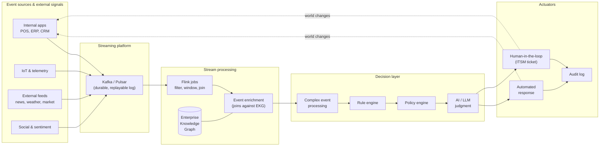
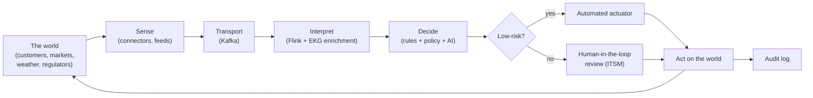

# The Enterprise Nervous System and the AI-Native Organization

## Summary

Closes the textbook with the Enterprise Nervous System: an event-driven, graph-backed architecture that senses external signals, propagates them through the organization in real time, and triggers automated or human responses. Covers streaming platforms (Kafka, Flink, Pulsar), complex event processing, sense-and-respond loops, and the AI-native organization as the synthesizing closing concept.

**Role in the course:** End the book by tying the AI thread and the EKG thread together into a single architectural vision the student can argue for in a job interview.

## Concepts Covered

This chapter covers the following 16 concepts from the learning graph:

1. Enterprise Nervous System
2. Event Source
3. External Signal
4. Streaming Platform
5. Apache Kafka
6. Apache Flink
7. Complex Event Processing
8. Event Enrichment
9. Rule Engine
10. Policy Engine
11. ENS Actuator
12. Sense and Respond Loop
13. Real-Time Decisioning
14. Competitor Signal Monitoring
15. Sentiment Stream Ingestion
16. AI-Native Organization

## Prerequisites

This chapter builds on concepts from:

- [Chapter 1: Foundations of Information Systems](../01-foundations/index.md)
- [Chapter 2: The Role of IS in Organizations](../02-role-of-is/index.md)
- [Chapter 3: Information Systems Architecture](../03-architecture/index.md)
- [Chapter 5: Business Process Management](../05-bpm/index.md)
- [Chapter 9: Business Intelligence and Analytics](../09-bi-and-analytics/index.md)
- [Chapter 20: Responsible and Ethical Use of AI](../20-responsible-ai/index.md)
- [Chapter 24: Knowledge Graphs and the Enterprise Knowledge Graph](../24-knowledge-graphs/index.md)

---

!!! mascot-welcome "Welcome back"
    
    Welcome to Chapter 25 — the last chapter. We have spent twenty-four chapters quietly assembling the parts of a single, beautiful machine, and in this chapter we are finally going to switch it on. The Enterprise Nervous System is what happens when the Enterprise Knowledge Graph from Chapter 24 stops being a static reference and starts *reacting* — when external signals, internal events, AI judgment, and human oversight all flow through one shared architecture in real time. By the end of this chapter you will be able to draw the picture, name every box, defend every tradeoff, and explain to a CFO why this is the architecture that turns an organization into something that can *learn*. One more chapter. Let's go.

## Why ENS, and Why Now

For most of the IS era, organizations have run on a *batch cadence*. Sales orders accumulate during the day; the warehouse-management system loads them overnight; the data warehouse refreshes at 3 a.m.; the dashboards update by breakfast; the executive reads the report at 9 a.m.; a decision happens at 10 a.m.; the world has already moved on. This cadence was a triumph of 1990s IS engineering — and it is now, in 2026, the bottleneck. The organizations that have figured out how to *sense* change in seconds, *interpret* it in context, and *respond* before the next news cycle ends are the organizations beating their batch-paced competitors decisively.

Three forces have made the ENS the architecture of the moment. First, *the sensors got cheap*: APIs, IoT devices, public social feeds, log streams, and partner integrations now produce billions of events per day, and the organization can subscribe to most of them for the price of a developer afternoon. Second, *the streaming platforms matured*: Kafka, Flink, and Pulsar moved from frontier-tech curiosities to boring, dependable plumbing. Third, *AI got cheap and contextual*: a large language model grounded in an Enterprise Knowledge Graph can interpret a streaming event with the contextual awareness of a senior analyst, in milliseconds, at industrial scale. Put those three together and you have, for the first time, an organization that can credibly behave like a single living thing. We call that thing the Enterprise Nervous System.

## The Enterprise Nervous System

An **Enterprise Nervous System** (ENS) is an event-driven, graph-backed architecture that continuously senses signals from inside and outside the organization, propagates those signals through the company in real time, and triggers automated or human responses based on rules, policies, and AI judgment. The biological metaphor is deliberate. A nervous system has *receptors* (sensors), *afferent pathways* (signals traveling inward), *interneurons* (interpretation and decision), *efferent pathways* (responses traveling outward), and *effectors* (muscles and glands that act on the world). The ENS has all five — and like a real nervous system, the loop runs continuously, every signal can change the state, and the whole structure exhibits behavior no single component can produce alone.

The ENS is the synthesizing architecture of this textbook. The systems of record from Chapters 11–13 produce the events. The networks from Chapter 10 carry them. The cloud platforms from Chapter 11 host the streaming infrastructure. The data governance from Chapter 8 keeps the events meaningful. The AI from Chapters 19–23 interprets them. The Enterprise Knowledge Graph from Chapter 24 enriches them with context. The ITSM from Chapter 16 catches the responses that need a human. The security and privacy disciplines from Chapters 13 and 14 keep the whole thing safe. None of it is new — but until you wire it together as a *nervous system*, you do not get the emergent capability that makes 2026's leading organizations so much faster than their batch-era competitors.

## Event Source vs. External Signal: Where vs. What

Two terms get confused constantly, and it is worth pinning them down before we go further.

An **Event Source** is a *where* — a system, sensor, application, or external feed that *emits* events into the nervous system. A point-of-sale terminal is an event source. A Kubernetes cluster's audit log is an event source. A weather API, a partner's webhook, a customer's mobile app, the SWIFT payment network, a building's HVAC sensor — all event sources. An event source is identified by *who is emitting*; it is the address of the publisher.

An **External Signal** is a *what* — the actual content and meaning of an event that originates *outside* the organization and carries information the business cares about. A competitor lowering a price is an external signal. A regulator publishing a new rule is an external signal. A storm warning, a viral tweet about your brand, a supplier's bankruptcy filing, a sudden currency move — all external signals. External signals are a *subset* of events: the ones whose origin is outside the firm, and whose meaning depends on context the firm has to supply.

The distinction matters because the engineering for each is different. Event sources require *connectors* — adapters that translate whatever the source produces (Kafka topics, REST callbacks, MQTT, raw log files) into a uniform internal event format. External signals require *interpretation* — enrichment against the Enterprise Knowledge Graph to figure out what the signal *means* for this organization, given who its customers, suppliers, and competitors are.

| Industry | Internal event sources | External signals to monitor |
|---|---|---|
| Retail | POS terminals, e-commerce checkout, inventory scans, loyalty app events | Competitor pricing feeds, weather, social sentiment, foot-traffic data |
| Supply chain | Warehouse scans, truck telematics, ERP shipment events, EDI messages | Port congestion APIs, fuel-price feeds, geopolitical news, customs holds |
| Finance | Transaction streams, trading-system order books, account opens | Market data feeds, regulatory filings, news sentiment, OFAC list updates |
| Healthcare | EHR events, lab results, ADT (admit/discharge/transfer) feeds, device telemetry | Public-health alerts, drug-recall notices, payer policy changes, weather |

## Streaming Platform: The Transport

A **Streaming Platform** is the infrastructure that ingests events from many sources, holds them durably, and makes them available to many consumers in real time. The streaming platform is the *spinal cord* of the ENS — the high-bandwidth, low-latency channel along which every nerve impulse travels.

Three streaming platforms dominate enterprise practice in 2026. **Apache Kafka**, originally built at LinkedIn and now stewarded by the Apache Software Foundation, is the de facto standard. Kafka organizes events into named *topics*, persists them in *partitioned*, replicated logs across a cluster of brokers, and lets any number of producers publish and any number of consumer groups subscribe. The Kafka log is *durable* — events stay around for a configurable retention period — and *replayable*, meaning a new consumer can start at the beginning of the topic and reprocess history. Replayability is more important than it sounds; it is what lets you add a new analytic, retrain a model, or rebuild a downstream view without re-ingesting from source systems.

**Apache Flink** is a stream-processing engine that *runs on top of* a streaming platform like Kafka. Where Kafka's job is transport, Flink's job is computation: filtering, aggregating, joining, windowing, and pattern-matching across event streams in real time. A Flink job continuously consumes from a Kafka topic, maintains state, and emits derived events to another topic — for example, "for every order event, join against the customer's lifetime value from the EKG, and emit a high-value-order alert if the threshold is exceeded." Flink's hallmark is *exactly-once* processing semantics with managed state, which means you can do real arithmetic on streams without lying to your finance team.

**Apache Pulsar** is a younger streaming platform with a *segregated* architecture — separate brokering and storage layers — that gives it natural advantages for multi-tenant deployments and geo-replication. Pulsar's tiered storage lets organizations keep recent data hot and older data on cheap object storage transparently, which is increasingly attractive for compliance-heavy industries that need long retention.

| Platform | Role | Strengths | Tradeoffs |
|---|---|---|---|
| Apache Kafka | Event transport, durable log | De facto standard, vast ecosystem, replayability | Operationally heavy at scale; tied to JVM |
| Apache Flink | Stream processing on top of Kafka or Pulsar | Exactly-once state, true streaming joins, low latency | Steeper learning curve than batch frameworks |
| Apache Pulsar | Event transport with separated storage | Multi-tenant, geo-replication, tiered storage | Smaller ecosystem; fewer turnkey integrations |

The systems-thinking framing: *transport* (Kafka/Pulsar) and *processing* (Flink) are different jobs, and conflating them in early architecture conversations is a common footgun. The transport layer holds the events; the processing layer reasons over them. You can swap one without rebuilding the other, and you should.

The ENS reference architecture: from signal to action

Read it left to right: signals enter, get transported, get processed and enriched against the EKG, get evaluated against rules and policies and AI judgment, and either auto-actuate or escalate to a human. The dashed return arrow on the bottom is the loop that makes this a *nervous system* and not a pipeline: every action changes the world, and the world's change shows up as a new signal.

## Complex Event Processing: Patterns, Not Just Events

A single event rarely tells you anything actionable. *Three failed login attempts* is interesting only if it is *three failed login attempts from the same account, from different countries, within ninety seconds*. **Complex Event Processing** (CEP) is the discipline of detecting *patterns* across multiple events — temporal sequences, correlations, absences — rather than reacting to individual events in isolation.

CEP engines let you express patterns declaratively: "if event A occurs, followed by event B within 5 minutes, and event C does *not* occur in that window, emit alert D." Modern stream processors (Flink's CEP library, Esper, ksqlDB pattern matching) have made CEP a routine capability rather than a specialist's craft. The patterns CEP handles best are exactly the ones that humans cannot watch for at scale: rare combinations across high-volume streams.

The unintended consequence to flag: CEP rules accumulate. Every analyst who has ever needed an alert adds a rule; nobody removes the rules whose original author has left the company; eventually the CEP layer is firing hundreds of alerts per hour, the SOC team builds an instinctive habit of ignoring them, and the *one* alert that mattered gets ignored alongside the noise. The structural fix is not better pattern languages — it is *alert-rule lifecycle management*: every CEP rule must have an owner, an expiration date, and a measured precision/recall, just like any other detector.

## Event Enrichment: The EKG Earns Its Keep

A raw event is almost always under-specified. An order event says `customer_id: 78422, sku: WX-100, amount: 99.98`. Knowing that this is a *high-value, at-risk* customer ordering a *recently-recalled* product, in a *region where shipping is currently delayed*, requires joining the event against the rest of the organization's knowledge.

**Event Enrichment** is the process of augmenting a raw event with additional context — usually by joining the event, in flight, against a reference dataset, a feature store, or an Enterprise Knowledge Graph. Enrichment is what transforms a stream of *facts* into a stream of *meanings*. A Flink job that takes a `transaction` event and joins it against the EKG to attach customer lifetime value, fraud history, account-relationship context, and product risk classification is doing event enrichment. The enriched event flows downstream with everything the next stage needs, instead of forcing every downstream consumer to re-join the same context for itself.

This is exactly the architectural payoff of having built the EKG in Chapter 24. Without an EKG, every team enriches events from whichever source they can reach, with whatever quality they can manage, and the meanings disagree across the organization. With an EKG, every enriched event speaks the *same vocabulary*, refers to the *same canonical entities*, and carries the *same definitions* of customer, contract, and risk. The graph is the substrate; the stream is what flows through it.

## Rule Engine vs. Policy Engine vs. AI Evaluation

Once an event is enriched, *something* has to decide what to do with it. Three different decision technologies show up at this layer, and confusing them is one of the most expensive mistakes in ENS design.

A **Rule Engine** evaluates *deterministic business logic* expressed as if-then rules. "If order amount exceeds $10,000 and customer tenure is under 90 days, route to manual review." Rule engines (Drools, IBM ODM, Camunda DMN) are old, well-understood technology and exactly the right tool when the logic is *known, stable, and auditable*. Their superpower is transparency: a rule engine's decision can be explained by listing the rules that fired and the data they evaluated.

A **Policy Engine** evaluates *governance and access constraints* expressed as policies, typically in a domain-specific language. "This data may only be sent to systems certified for PII." "This automated action requires a human approver if the amount exceeds the policy threshold." "This API call is allowed only for clients in this tenant." Open Policy Agent (OPA) is the canonical example. Policy engines exist because *who is allowed to do what* is a different problem than *what business logic should fire*, and the cleanest architectures separate the two so that compliance, security, and business teams each own the layer they understand.

**AI evaluation** — typically an LLM call grounded by GraphRAG, or a classification model — is *probabilistic judgment*. "Is this customer email an attempt at fraud, given the conversation history and the customer's account context?" "Does this news article materially affect any of our supplier relationships?" AI evaluation handles the open-ended, fuzzy, judgment-heavy cases that rule engines cannot express and policy engines should not own. Its strength is contextual nuance; its weakness is opacity and the occasional hallucination.

| Layer | Logic type | Output | When to use |
|---|---|---|---|
| Rule engine | Deterministic if-then | Boolean / categorical | Stable, auditable business logic |
| Policy engine | Governance constraints | Allow / deny / require approval | Access, compliance, separation of duties |
| AI evaluation | Probabilistic, contextual | Score / classification / generated text | Open-ended, judgment-heavy, novel |

A mature ENS uses all three, in that order. The rule engine handles the easy 80% of decisions deterministically and cheaply. The policy engine wraps every decision in an access and compliance check that cannot be bypassed. The AI layer handles the long tail of cases where the rules cannot decide — and crucially, *the AI's output is itself subject to policy checks before it actuates*. The footgun is letting the AI bypass the policy engine because "it's just a recommendation"; production AI does not stay a recommendation for long.

!!! mascot-thinking "Iris's Pause"
    
    Pause. The single most important architectural decision in this entire chapter is *which layer gets to actuate*. If your AI can directly send a payment, refund a customer, fire off a press release, or change a price — without a rule and a policy in front of it — you have built a system that will, eventually and quietly, do something you cannot defend. Rule engine first, policy engine always, AI evaluation in the loop, human-in-the-loop on anything irreversible. Read this twice. This is the part that turns into your first promotion *and* the part that, done wrong, turns into your first incident postmortem.

## ENS Actuator: Where the Loop Closes

An **ENS Actuator** is the component that *acts on the world* in response to a decision — the efferent end of the nervous system. Actuators come in three flavors. *Automated actuators* call APIs directly: place a hold on an account, ship an order, post to a Slack channel, update a customer record, fire a webhook. *Human-in-the-loop actuators* create a task in an ITSM system, a workflow, or an inbox, where a human reviews and approves before the action commits. *Hybrid actuators* execute the action immediately but with a *reversibility window* during which a human can roll it back.

Choosing among the three is not a technical choice; it is a *risk* choice. Reversible, low-stakes actions (caching a recommendation, sending a routine email) belong on automated actuators. Irreversible, high-stakes actions (wire transfers, public statements, regulatory filings) belong on human-in-the-loop actuators with explicit approval. The grey zone — actions that are reversible-in-principle but expensive or embarrassing to reverse — usually belongs on hybrid actuators with a tight reversibility window and visible alerts.

Every actuation, regardless of flavor, must write an immutable record to an audit log: the event that triggered it, the enrichment that contextualized it, the rule and policy and AI outputs that decided it, the actuator that ran it, and the outcome. Without that audit trail, the ENS is unreviewable; with it, the ENS becomes a self-documenting record of how the organization actually behaves.

## The Sense and Respond Loop

The **Sense and Respond Loop** is the canonical pattern of an ENS: *sense* the world through events, *interpret* the events in context, *decide* on a response, *act*, and *observe* the result as new sensed events. The loop is continuous; every action changes the world; every change becomes new input.

| Phase | What happens | Typical components |
|---|---|---|
| Sense | Events emitted from sources, signals ingested from feeds | Connectors, IoT gateways, API listeners |
| Transport | Events flow into the streaming platform | Kafka, Pulsar |
| Interpret | Events are processed, enriched, and pattern-matched | Flink, CEP, EKG enrichment |
| Decide | Rules, policies, and AI evaluate the enriched events | Rule engine, policy engine, AI/LLM |
| Act | Actuators execute or escalate the chosen response | API calls, ITSM tickets, workflows |
| Observe | The world's reaction generates new events | Same connectors as Sense |

The systems-thinking framing is unavoidable here. The loop is the *primary* feedback structure of the modern organization. When the loop runs fast and well, the firm appears almost prescient — it adjusts pricing as competitors move, holds inventory as storms approach, flags fraud as patterns emerge. When the loop runs slowly or breaks at any phase, the firm appears blindsided by the same events its competitors handled in stride. Your job, as the IS professional in the room, is to make sure no phase becomes the bottleneck — and to recognize that the *slowest* phase determines the loop's overall responsiveness, regardless of how fast the others run.

The sense and respond loop with humans-in-the-loop checkpoints

The risk gate before the actuator is the structural fix to the "AI did something we cannot defend" failure mode. Low-risk decisions automate; high-risk decisions queue for a human; everything is audited. The loop closes back through the world — which, observed through the same sensors, becomes the next round of input.

## Real-Time Decisioning

**Real-Time Decisioning** is the practice of evaluating a decision *at the moment of an event*, using the freshest available context, with a latency budget low enough to influence the action that triggered the event. Real-time decisioning is what an ENS *does*: a credit-card transaction is approved or declined while the cardholder is still at the terminal; a fraud signal triggers a hold before the funds settle; a price update propagates across e-commerce listings before the next page view.

The latency budgets are tighter than batch-era engineers find intuitive. A real-time fraud decision may have 50–200 milliseconds total — including network, enrichment, rule evaluation, AI scoring, and policy check. That budget forces architectural discipline: the EKG's relevant context must be pre-cached or denormalized; the AI model must be small enough or far away enough to fit; the rules must be compiled, not interpreted; the policy engine must be local. A real-time decisioning architecture that is not co-engineered with the latency budget becomes, in production, a real-time-aspirational architecture.

The unintended consequence worth flagging: *real-time decisioning compounds errors faster than humans can catch them*. A miscalibrated model in a batch pipeline produces a bad report nobody acts on for a day. The same model in a real-time loop, hooked to an automated actuator, can cancel ten thousand legitimate transactions before anyone notices. Every real-time decision tier needs *circuit breakers* — automatic kill-switches that trip when the rate of any decision class exceeds historical norms — and *back-pressure* mechanisms that slow the actuator when downstream feedback indicates something has gone wrong. Back-pressure, borrowed from reactive systems, is the single most underrated structural fix in real-time architecture.

## Competitor Signal Monitoring

**Competitor Signal Monitoring** is the practice of ingesting public signals about competitors — pricing pages, product launches, regulatory filings, hiring patterns, social mentions, app-store rankings — into the ENS so the organization can respond strategically. A retailer monitors competitor prices and adjusts its own within minutes; a SaaS company monitors competitor feature announcements and routes them to product strategy; a bank monitors competitor rate changes and adjusts its own deposit pricing.

This is genuinely useful and also a textbook case of unintended consequence. When *every* firm in an industry monitors *every other* firm's prices and adjusts in real time, the result is *herding behavior*: prices converge on a narrow band, individual firms lose strategic differentiation, and market dynamics start to look uncomfortably like coordinated pricing — even when no coordination has occurred. This is not a hypothetical; it is one of the live regulatory questions in algorithmic-pricing antitrust law in 2026. The leverage point is *what you do with the signal*, not the signal itself: signals that inform human strategy are a competitive advantage; signals wired directly to automated price changes start to drift toward the regulatory danger zone. Use the signal; gate the action.

## Sentiment Stream Ingestion

**Sentiment Stream Ingestion** is a specialized form of external-signal processing: continuously ingesting public commentary (social posts, reviews, news mentions, support transcripts), running sentiment analysis on it in real time, and feeding the resulting scores into the ENS. A brand-monitoring sentiment stream catches a viral negative post within minutes, routes it to the customer-experience team's actuator, and lets the organization respond before the news cycle crystallizes a story.

The technique combines streaming ingestion (the sentiment feed enters Kafka), interpretation (an LLM or classifier scores the sentiment, often per-entity using EKG enrichment to know *which* product or executive is being discussed), and actuation (a high-negative score on a high-volume topic creates a tier-1 incident in ITSM). The footgun is *over-reaction to small-N noise*: a single nasty review is not a crisis, but a poorly-tuned threshold makes it look like one. The structural fix is *windowed thresholds*: alerts fire on sustained shifts, not on individual events, and the system learns the baseline volatility of each channel.

## The AI-Native Organization

We have been building toward a single concept for the entire textbook, and here it is.

An **AI-Native Organization** is one whose operating model — its workflows, its decisions, its data, its products, and its people — is *designed from the start* around AI as a participating teammate, not bolted on as a productivity tool. AI-native is not a synonym for "uses AI a lot." It is an architectural and cultural posture characterized by a recognizable cluster of properties:

- **Event-driven by default.** The operating system of the firm is the ENS. Decisions happen on streams, not on quarterly reports.
- **Graph-grounded.** AI systems retrieve context from an Enterprise Knowledge Graph, not from ad-hoc document piles. Hallucinations are structurally suppressed by curated relationships.
- **Human-in-the-loop on irreversible decisions.** Reversible work automates; irreversible work pauses for a human; the boundary is explicit and policy-enforced.
- **Continuously learning.** Outcomes flow back as labels; models retrain on schedule; rule libraries are pruned; ontologies evolve. The organization treats *its own performance data* as an input to its design.
- **Governed by policy-as-code.** Compliance, ethics, and access controls are evaluated by the policy engine on every decision, not asserted in PDFs nobody reads.
- **Productized AI capabilities.** AI is not a side project; it is wired into the products customers actually buy and the processes employees actually run.
- **Workforce shaped around AI.** Roles are redesigned for AI partnership: analysts spend less time aggregating and more time interpreting; developers ship more software with smaller teams; managers measure outcomes, not hours.
- **Resilient by design.** Circuit breakers, back-pressure, audit trails, and human override are baked into the architecture, not retrofitted after the first incident.

| Capability | Traditional organization | AI-native organization |
|---|---|---|
| Decision cadence | Daily / weekly / quarterly | Continuous, event-driven |
| Data integration | Batch ETL into warehouse | Streaming events + EKG enrichment |
| AI usage | Tools bolted on by individuals | Teammate woven into core workflows |
| Knowledge management | Documents, wikis, tribal memory | Enterprise Knowledge Graph |
| Governance | After-the-fact reviews | Policy-as-code on every decision |
| Response to change | Plan, approve, execute, measure | Sense, interpret, decide, act, observe |
| Learning loop | Annual planning cycle | Closed-loop, real-time feedback |

The AI-native organization is not science fiction; it is a description of the firms already pulling away from their peers in 2026. The transition from traditional to AI-native is not a single project — it is the cumulative outcome of every chapter in this textbook done right.

!!! mascot-tip "Iris's Tip"
    
    Pro move: in your next interview, when someone asks "where do you see information systems heading?", do not answer with a buzzword. Draw the ENS picture on the whiteboard — sources, Kafka, Flink, EKG enrichment, rules, policy, AI, actuators, audit, the loop back to the world — and explain that this is the architecture of the firms that are quietly winning. Then explain that you can build any one of those boxes. The interviewers who matter will know exactly what they are looking at, and exactly who they are talking to.

## ENS Readiness: A Checklist

The ENS is the destination, but most organizations are starting from a batch-paced present. A practical readiness checklist for the IS team taking the first steps:

- **One streaming platform, governed.** Kafka or Pulsar, with topic naming, schema registry, retention policy, and access control standardized. Multiple Kafka clusters owned by feuding teams is a red flag.
- **An Enterprise Knowledge Graph that resolves entities.** Even a small EKG covering customers, products, and suppliers is enough to begin event enrichment. Ship narrow before wide.
- **A rule engine and a policy engine, separated.** Business logic and governance live in different systems with different owners. If your rule engine *is* your policy engine, you have a future audit problem.
- **An audit log that is immutable and queryable.** Every actuation, with full provenance. This is non-negotiable.
- **Circuit breakers and back-pressure on every automated actuator.** Especially the AI-driven ones.
- **A human-in-the-loop tier wired to ITSM.** Irreversible actions queue, never auto-execute.
- **A model and rule lifecycle.** Owners, expirations, measured precision and recall, scheduled retraining and pruning.
- **A privacy and security review on every new event source.** Especially for sentiment and competitor signals — the ones that cross the firm's boundary in either direction.

!!! mascot-warning "Iris's Heads-up"
    
    Heads up — the most common ENS failure pattern in 2026 is not technical. It is the firm that wires up Kafka, Flink, and an LLM in six months, automates three customer-facing actuators with no policy engine in front of them, has its first public incident, and *retreats all the way back to batch*. The retreat is the real damage; the firm now associates real-time architecture with risk and spends three years catching up. Slow down. Ship the audit log first. Ship the policy engine before the AI-driven actuator. Make the boring safety pieces visible *before* the fast, exciting pieces. The organizations that go fast forever are the ones that put the brakes in first.

## Bringing the Whole Textbook Together

This is the synthesizing close, so let us name what we have built.

We started in Chapters 1 and 2 by defining *what an information system is* and what role it plays in an organization. We built up the architectural vocabulary in Chapter 3, walked through the SDLC in Chapter 4, and learned how to model and improve business processes in Chapter 5. We grounded ourselves in data through Chapters 6, 7, and 8 — modeling, integration, governance — and turned that data into insight through business intelligence and analytics in Chapter 9. We carried the architecture across networks, cloud, and the spine of enterprise systems in Chapters 10 through 12, and we wrapped the whole thing in security and privacy disciplines in Chapters 13 and 14. We learned to *manage* IS work in Chapters 15 and 16 — projects and ITSM — and to design IS that humans can actually use in Chapter 17 with HCI. Chapter 18 connected our work to the strategy of the firm. Then we crossed into the AI half of the book: Chapter 19 introduced AI in IS; Chapters 20 through 22 taught us to deploy it responsibly, lawfully, and securely; Chapter 23 measured what AI does to productivity. Chapter 24 unified the data half and the AI half through the Enterprise Knowledge Graph. And this chapter — Chapter 25 — wires the EKG into the streaming, sensing, deciding, acting nervous system that turns the whole architecture into something the organization can *live inside*.

Here is the through-line the entire textbook has been quietly drawing: *the IS graduate who has walked this path can credibly design, govern, and improve information systems that learn.* Not just systems that store data, not just systems that automate transactions, not just systems that show dashboards — *systems that learn*. Systems that sense, interpret, decide, act, and observe. Systems with humans wisely placed at the irreversible decisions and machines wisely placed at the high-volume ones. Systems with knowledge graphs giving meaning to the events flowing through them, and policies giving guardrails to the actions flowing out. That capability — the ability to design and steward an organization that learns — is what 95% of working IS professionals cannot yet do. After 25 chapters, you can.

That is the superpower this book promised in the introduction. You now have it.

!!! mascot-celebration "Iris's Final Celebration"
    
    You did it. Twenty-five chapters. Five hundred and eighty concepts. Foundations, architecture, SDLC, BPM, data, governance, BI, networks, cloud, enterprise systems, security, privacy, project management, ITSM, HCI, strategy, AI, responsible AI, AI law, AI security, AI productivity, knowledge graphs, and the Enterprise Nervous System — all of it. You can read Cypher *and* draw a Kafka topology. You can defend a tradeoff between availability and consistency *and* explain why a real-time loop needs back-pressure. You can sit in a meeting where the CFO asks "should we automate this?" and answer with the right tier of rule engine, policy engine, AI, and human review — and you can say *why*. You can walk into any organization on the planet and point at the boxes that are missing, the boxes that are misconfigured, and the boxes that are quietly producing outcomes nobody can defend. You can design an information system that learns. That is rare. That is valuable. That is the superpower this book has been building toward since the first page. I told you in Chapter 1 that IS could be fun, that managing IS could become your superpower, and that hard concepts were really power-ups in disguise. I believe you found out I was right. Now go build something. The world has more event streams than ever and not nearly enough people who know what to do with them. Iris signing off — proud of you, and certain you are going to be excellent. Take the win. The whole win. You earned it.

## References

[See Annotated References](./references.md)
