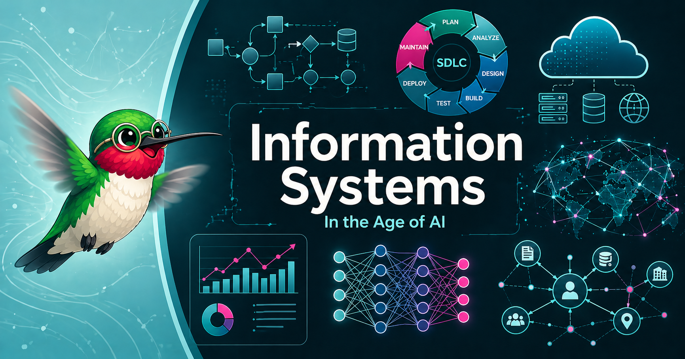

# Welcome

<figure markdown>
  { width="100%" }
</figure>

!!! mascot-welcome "Hi, I'm Iris."
    
    Welcome. Over the next 25 chapters we are going to take you from
    "what is data?" all the way to "what is an Enterprise Nervous System?"
    — and along the way you will learn to run a help desk, design a data
    warehouse, ship a RAG prototype, *and* explain to a CFO why any of
    that matters. Let's go.

## What This Book Is

An **ABET CAC-aligned**, AI-forward intelligent textbook on Information
Systems for college sophomores and juniors — 580 concepts, 25 chapters,
seven parts, one hummingbird. It covers the full IS curriculum:
application development, data management, networks, security, IS project
management, and the parts most textbooks skip — Enterprise Knowledge
Graphs, GraphRAG, agentic AI, and what an *Enterprise Nervous System*
looks like when it works.

The thesis we keep coming back to:

> **IS can be fun. Managing IS can become your superpower.**

## Who This Book Is For

- Undergraduates in Information Systems, Information Technology, Business
  Analytics, Computer Information Systems, or related computing-and-business
  programs
- Programs pursuing **ABET Computing Accreditation Commission (CAC)**
  accreditation under the IS program criteria
- Working professionals who want a current, AI-aware refresh of the field
- Curious readers who suspect the database is more interesting than their
  intro course made it look

Prerequisite: one introductory programming course in any modern language.
That's it.

## What Makes This Book Different

- **AI is core curriculum, not a side exhibit.** Roughly half the book is
  about how AI changes the practice of IS — prompt engineering, RAG,
  Enterprise Knowledge Graphs, agentic systems, AI-assisted software
  development.
- **Systems thinking is taught throughout.** Every chapter looks for
  tradeoffs, feedback loops, leverage points, and unintended consequences.
  By the end you will reflexively ask, *"What else does this touch?"*
- **Interactive everything.** [MicroSims](sims/index.md) let you play with
  concepts. The [Learning Graph](learning-graph/index.md) lets you see
  how all 580 concepts connect. Quizzes, glossary, and FAQs are wired in.
- **Iris hangs around.** The book has a mascot — a hummingbird with
  wire-rim glasses — who shows up to point at the parts that matter.

## How to Use This Book

Use the side navigation to explore:

- **Chapters** — the main reading path, organized into seven parts
- **Learning Graph** — interactive view of all 580 concepts and their
  dependencies
- **MicroSims** — small interactive simulations you can poke at
- **Glossary** — every key term with a precise, non-circular definition
- **FAQ** — common questions and the answers we wish someone had given us
- **References** — curated further reading per chapter

## Getting Started

Start with [Chapter 1: Foundations](chapters/01-foundations/index.md) —
or, if you want the map first, take a look at the
[Learning Graph](learning-graph/index.md) and pick a topic that catches
your eye.

## License

This book is published under a Creative Commons license. You are
encouraged to use it in your courses, fork it, remix it, and share it —
see [About](about.md) for details.
