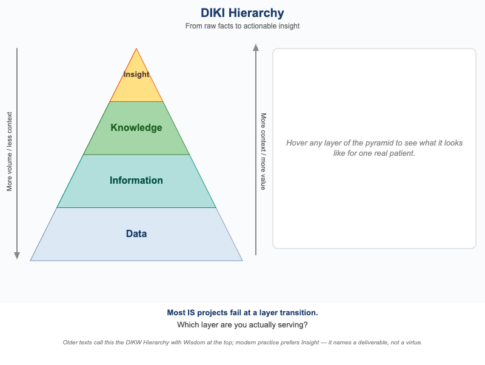
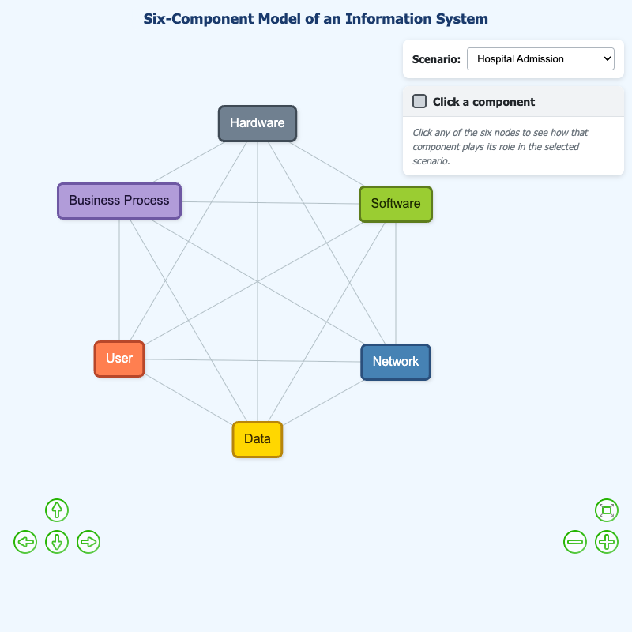

# List of MicroSims for Information Systems

Interactive Micro Simulations to help students learn information systems
fundamentals — from data hierarchies and ERDs to enterprise architecture,
project management, security, and AI-native operations.

<!--
TODO: Remove the HTML comments around the image (![]) lines below
once each MicroSim has its screenshot captured.

To capture a missing screenshot, run from the project root:
  bk-capture-screenshot docs/sims/<sim-name> 3 <iframe-height>

The iframe height comes from each sim's index.md (the height attribute
on its <iframe> tag — typically CANVAS_HEIGHT + 2).
-->

-   **[A Cross-Border Data Flow Decision Tree](./cross-border-transfer-decision/index.md)**

    <!--  -->

    A Cross-Border Data Flow Decision Tree

-   **[A Digital Twin of a Wind Turbine](./digital-twin-wind-turbine/index.md)**

    <!--  -->

    A Digital Twin of a Wind Turbine

-   **[A Modern CI/CD Pipeline](./cicd-pipeline/index.md)**

    <!--  -->

    A Modern CI/CD Pipeline

-   **[A Modern Enterprise Network — LAN, WAN, VPN, SD-WAN, Cloud](./enterprise-network-topology/index.md)**

    <!--  -->

    A Modern Enterprise Network — LAN, WAN, VPN, SD-WAN, Cloud

-   **[A Simple Feature-Branch Git Workflow](./git-feature-branch-workflow/index.md)**

    <!--  -->

    A Simple Feature-Branch Git Workflow

-   **[A Small Business ERD — Customer, Order, Product, Supplier](./small-business-erd/index.md)**

    <!--  -->

    A Small Business ERD — Customer, Order, Product, Supplier

-   **[A Small Project's Gantt Chart with the Critical Path Highlighted](./gantt-with-critical-path/index.md)**

    <!--  -->

    A Small Project's Gantt Chart with the Critical Path Highlighted

-   **[A Sprint Burndown Chart (Ideal vs Actual)](./sprint-burndown-chart/index.md)**

    <!--  -->

    A Sprint Burndown Chart (Ideal vs Actual)

-   **[A Value Stream Map of an Invoice-Approval Process](./value-stream-map-invoice-approval/index.md)**

    <!--  -->

    A Value Stream Map of an Invoice-Approval Process

-   **[An Enterprise Journey Map for a Claims Process](./journey-map-claims-process/index.md)**

    <!--  -->

    An Enterprise Journey Map for a Claims Process

-   **[Anatomy of a BPMN Order-to-Cash Process](./bpmn-order-to-cash/index.md)**

    <!--  -->

    Anatomy of a BPMN Order-to-Cash Process

-   **[API Gateway Request Flow](./api-gateway-flow/index.md)**

    <!--  -->

    API Gateway Request Flow

-   **[As-Is vs To-Be — Manual, RPA, and Workflow Automation](./as-is-to-be-automation-comparison/index.md)**

    <!--  -->

    As-Is vs To-Be — Manual, RPA, and Workflow Automation

-   **[Bandwidth, Latency, and Throughput at a Glance](./bandwidth-latency-throughput/index.md)**

    <!--  -->

    Bandwidth, Latency, and Throughput at a Glance

-   **[Build vs Buy vs SaaS Decision Flow](./build-buy-saas-decision/index.md)**

    <!--  -->

    Build vs Buy vs SaaS Decision Flow

-   **[Container vs. Virtual Machine Architecture](./container-vs-vm-architecture/index.md)**

    <!--  -->

    Container vs. Virtual Machine Architecture

-   **[DIKI Hierarchy Interactive Pyramid](./diki-pyramid/index.md)**

    <!--  -->

    An interactive four-level pyramid visualizing the Data, Information, Knowledge, and Insight hierarchy with a hospital-patient example at every layer.

-   **[EVM Cost and Schedule Variance Visualization](./evm-variance-visualization/index.md)**

    <!--  -->

    EVM Cost and Schedule Variance Visualization

-   **[Executive IS Roles and Reporting Relationships](./is-executive-roles/index.md)**

    <!--  -->

    Executive IS Roles and Reporting Relationships

-   **[graph-viewer](./graph-viewer/index.md)**

    <!--  -->

    graph-viewer

-   **[Mobile-First Responsive Breakpoints](./responsive-breakpoints-demo/index.md)**

    <!--  -->

    Mobile-First Responsive Breakpoints

-   **[Normalization Journey from 1NF to 3NF](./normalization-journey-1nf-to-3nf/index.md)**

    <!--  -->

    Normalization Journey from 1NF to 3NF

-   **[Porter Value Chain with IS Overlay](./porter-value-chain/index.md)**

    <!--  -->

    Porter Value Chain with IS Overlay

-   **[Sequence Diagram for "Place Order](./place-order-sequence-diagram/index.md)**

    <!--  -->

    Sequence Diagram for "Place Order

-   **[Shared Responsibility Across IaaS, PaaS, SaaS, and FaaS](./cloud-shared-responsibility-stack/index.md)**

    <!--  -->

    Shared Responsibility Across IaaS, PaaS, SaaS, and FaaS

-   **[Six-Component Model of an Information System](./six-component-model/index.md)**

    <!--  -->

    Six-Component Model of an Information System

-   **[State Diagram for "Loan Application Status](./loan-application-state-diagram/index.md)**

    <!--  -->

    State Diagram for "Loan Application Status

-   **[STRIDE Overlay on a Simple Web Application](./stride-threat-model-overlay/index.md)**

    <!--  -->

    STRIDE Overlay on a Simple Web Application

-   **[The Enterprise Systems Landscape with ERP at the Center](./enterprise-systems-landscape/index.md)**

    <!--  -->

    The Enterprise Systems Landscape with ERP at the Center

-   **[The ERP Implementation Timeline with Cutover](./erp-implementation-timeline/index.md)**

    <!--  -->

    The ERP Implementation Timeline with Cutover

-   **[The Project Triangle (Scope, Time, Cost — and Quality in the Middle)](./project-triangle/index.md)**

    <!--  -->

    The Project Triangle (Scope, Time, Cost — and Quality in the Middle)

-   **[The Regulatory Landscape Map](./privacy-regulatory-landscape/index.md)**

    <!--  -->

    The Regulatory Landscape Map

-   **[The Scrum Sprint Cycle](./scrum-sprint-cycle/index.md)**

    <!--  -->

    The Scrum Sprint Cycle

-   **[The Six Rs Decision Tree](./six-rs-decision-tree/index.md)**

    <!--  -->

    The Six Rs Decision Tree

-   **[The Stakeholder Power/Interest Grid](./stakeholder-power-interest-grid/index.md)**

    <!--  -->

    The Stakeholder Power/Interest Grid

-   **[The Technical Debt Feedback Loop](./tech-debt-feedback-loop/index.md)**

    <!--  -->

    The Technical Debt Feedback Loop

-   **[The Waterfall Model](./waterfall-model/index.md)**

    <!--  -->

    The Waterfall Model

-   **[Three-Tier Architecture with Request Flow](./three-tier-architecture/index.md)**

    <!--  -->

    Three-Tier Architecture with Request Flow

-   **[TLS Handshake and the Chain of Trust](./tls-handshake-chain-of-trust/index.md)**

    <!--  -->

    TLS Handshake and the Chain of Trust

-   **[Use Case Diagram for a Small Library System](./library-use-case-diagram/index.md)**

    <!--  -->

    Use Case Diagram for a Small Library System

-   **[Write Skew Under Read Committed Isolation](./write-skew-read-committed/index.md)**

    <!--  -->

    Write Skew Under Read Committed Isolation

-   **[Zero Trust Architecture vs Castle-and-Moat](./zero-trust-vs-castle-moat/index.md)**

    <!--  -->

    Zero Trust Architecture vs Castle-and-Moat

